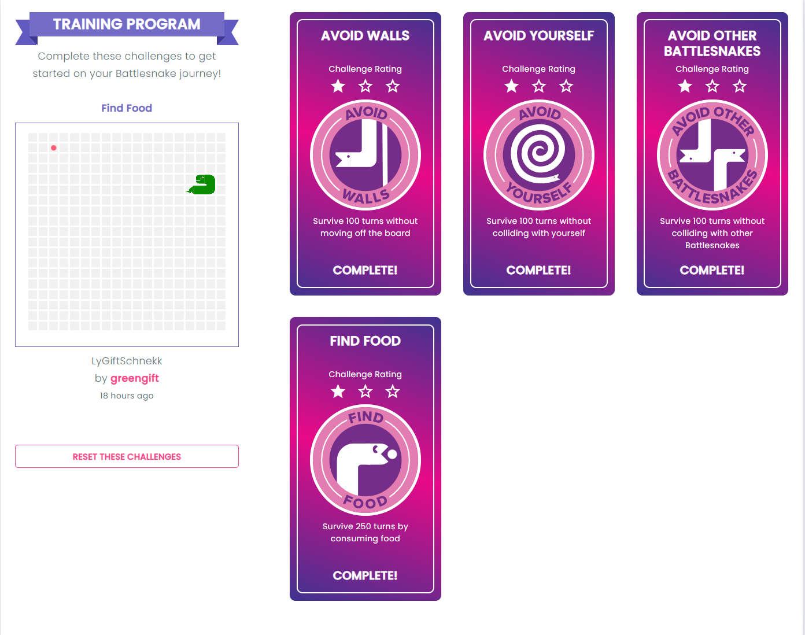

# BattleSnake

It's a basic snake for the game called battle snake.
(https://play.battlesnake.com/) 
It is based on the ktor framework.

The snake completed these challenges:

 

The program supports https, but it needs a certificate for that.
The docs for the api is here: https://docs.battlesnake.com/references/api